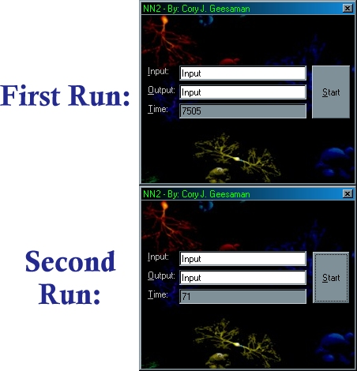



## Neural Net II

### Description

This new version of my neural net is not like the frst one at all...it is a complete remake and works much better(plus this one has a purpose). the net can be trained to do a single task in a few seconds, then after that it will take less that a second(at least on my comp) to do the same task over, it is an excellent way of having a computer learn something(in this case a string). If you like this please post comments and vote, also if you are working w/ NeuralNets then please email me and we can work together(with an app i am making that will allow ppl to use the same code-window for 10 diff languages..i will post it when done)-BTW: because of a complaint from them i now know that the background image i use on this originally came from RG Soft and is copyrighted by them.
 
### More Info
 

             |
---                |---
**Submitted On**   |2001-08-21 18:07:30
**By**             |[Cory J\. Geesaman](https://github.com/Planet-Source-Code/PSCIndex/blob/master/ByAuthor/cory-j-geesaman.md)
**Level**          |Intermediate
**User Rating**    |3.4 (17 globes from 5 users)
**Compatibility**  |VB 5\.0, VB 6\.0
**Category**       |[Miscellaneous](https://github.com/Planet-Source-Code/PSCIndex/blob/master/ByCategory/miscellaneous__1-1.md)
**World**          |[Visual Basic](https://github.com/Planet-Source-Code/PSCIndex/blob/master/ByWorld/visual-basic.md)
**Archive File**   |[Neural Net250978212001\.zip](https://github.com/Planet-Source-Code/cory-j-geesaman-neural-net-ii__1-26478/archive/master.zip)

